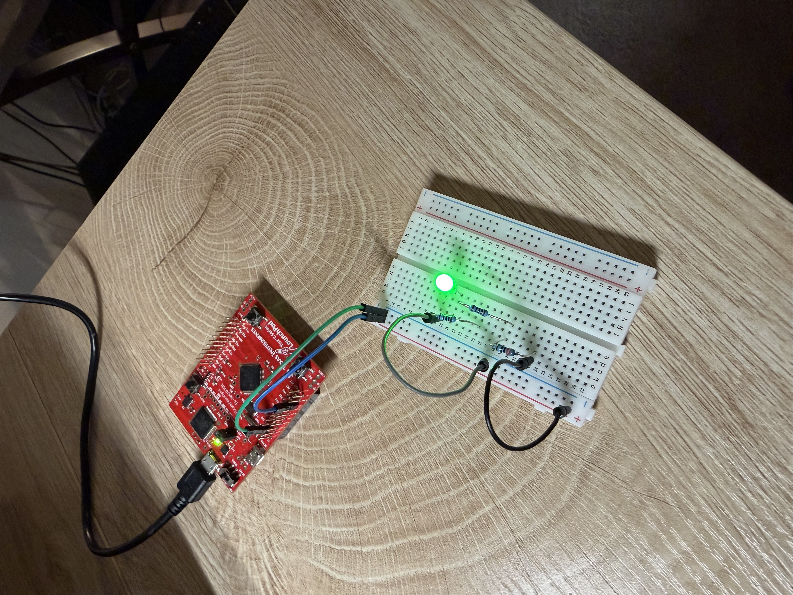

# ECE-455 Lab 1

Name: Paul Blair

NetID: VBQ669

## R1: External LED

## R2: Resistor Calculation

$R = \frac{(V_o - V_f)}{I}$

$V_o = 3.3V$

Note: This forward voltage was measured with a multimeter.

$V_f = 1.81V$

Desired Current $I = 2mA$

$R = \frac{(3.3 - 1.81)}{.002}$

Desired Resistance $R = 745ohms$

Actual  Resistance $R = 530ohms$

$530 = \frac{(3.3 - 1.81)}{I_A}$

Actual Current $I_A = 2.81mA$
