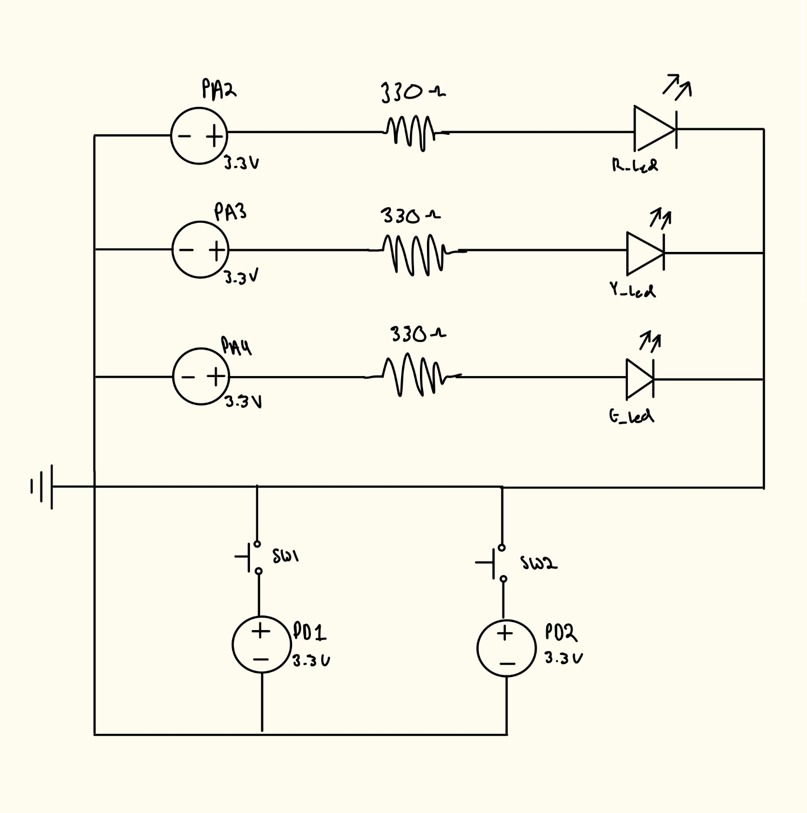
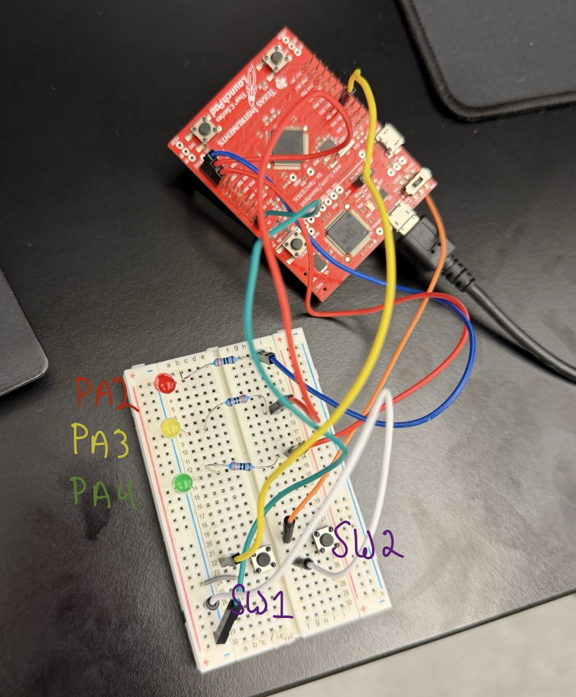
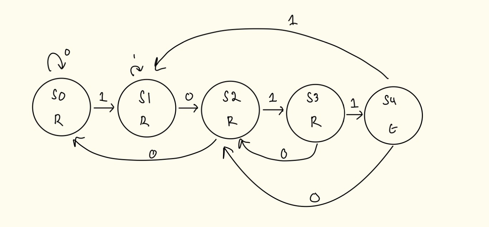
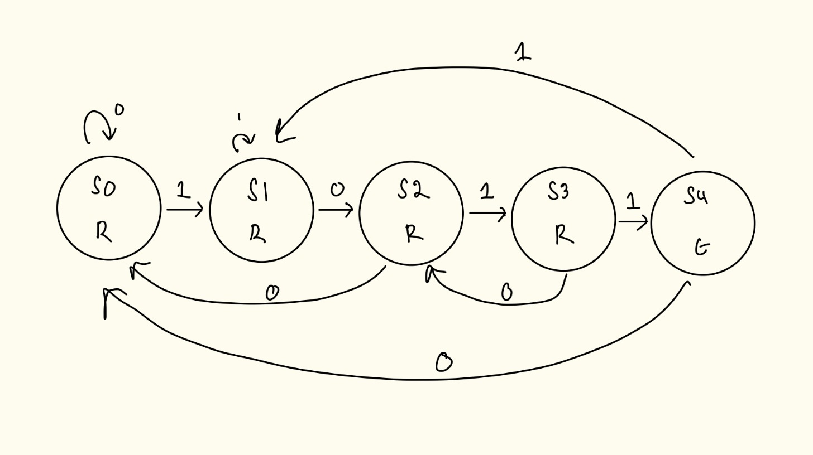

# ECE-455 Lab 2

Name: Paul Blair, Benjamin Drumwright

NetID: VBQ669, BDRUMWRI

## R1: External LED

## R2: Sequence Detector

Design choice for Sequence Detector:

For the implementation for this we choose to store each input in a
uint8_t (0b0000_0000). By doing this we can shift each input in and
then check if it matches the pattern (0b1011). Then on each input we
are able to check the if the lower 4 bits of the uint8_t is equal to the
pattern (pattern & 0b1011) == 0b1011.

State Graph Overlapping

State Graph Without Overlapping

