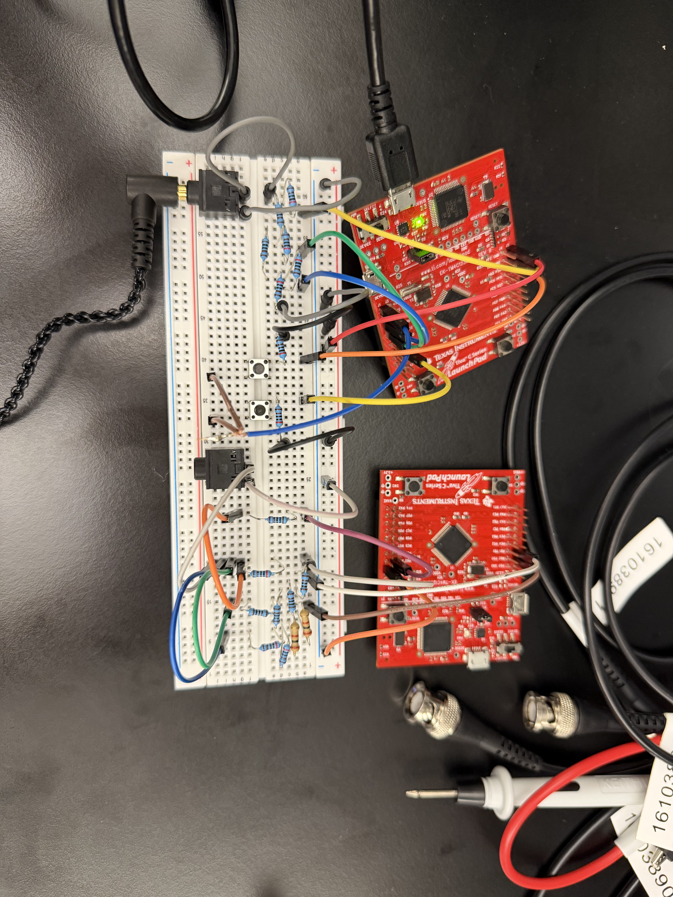

# Lab 3: Report

**Name:** Paul Blair, Benjamin Drumwright

NetID: VBQ669, BDRUMWRI

We built the circuits together and both worked on the code.
Ben wrote the code for part 2 and Paul wrote the code for
part 1. We worked on part 3 together.

## R1

Circuit for R1 (On the left) and R2 (On the Right)

Note about the circuits: we didn't have the correct resistors so
                         we used 1k and 2k resistors in series to
                         get to the correct resistance values.

## R2

